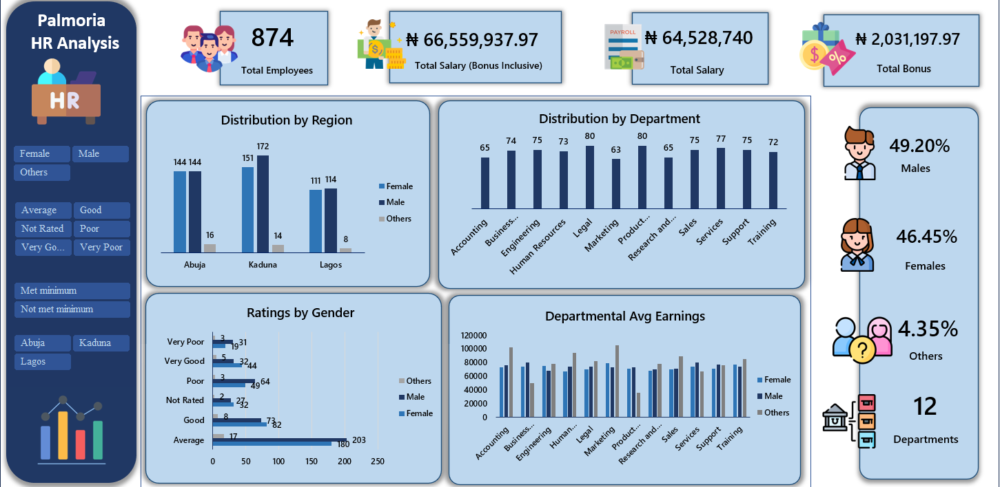

# Palmoria-Group-HR-Analysis
The Palmoria Group, a manufacturing company based in Nigeria, is embroiled in issues  bordering on gender inequality in its 3 regions.
The project is focused on uncovering the presence of employee discrimination and inequality

---

<h1>1.	Project Overview</h1>

 <h2>•	Problem Statement</h2>
 The recent negative media portrayal of The Palmoria Group as "the Manufacturing Patriarchy" has created a severe reputational crisis that directly endangers the company's strategic growth ambitions. This publicity exposes the organization to significant operational, legal, and brand risks by highlighting perceived systemic gender inequality. The immediate business problem is to objectively diagnose, quantify, and eradicate gender-based disparities across all people processes to safeguard the company's reputation, ensure long-term viability, and build an equitable workplace that facilitates scalable growth.
  
  <h2>•	Objectives:</h2>
  
  The major objectives of the project is to:

• Diagnose Gender Representation Equity

• Establish Pay Equity and Identify Gaps

• Ensure Performance Management Fairness

---

<h1>2.	Data Source</h1>

The data was obtained from hand to hand. Click on the link below to download the raw file

[Raw file1](https://github.com/IluyemiJoy/Palmoria-Group-HR-Analysis/raw/refs/heads/main/Palmoria%20Group%20emp-data.xlsx) [Raw file2](https://github.com/IluyemiJoy/Palmoria-Group-HR-Analysis/raw/refs/heads/main/Palmoria%20Group%20Bonus%20Rules.xlsx)

---

<h1>3. Business Questions </h1>
Click on the link below to download the file

[Business Questions](https://github.com/IluyemiJoy/Palmoria-Group-HR-Analysis/raw/refs/heads/main/BUSINESS%20QUESTIONS.docx)

---

<h1>4.	Methodology</h1>

<h2>•	Tools Used</h2>
The dashboard was built using the following tools and technologies:

i.	**Microsoft Excel** – Main data analysis and visualization platform used.

ii.	**Power Query** – Data transformation and cleaning layer for reshaping and preparing data.

iii.	**Power Pivot** - Used to create Pivot tables

iv **Pivot Table** – Used for analysis

v.	**File format** - .xlsx for development and .png for dashboards preview

<h2>•	Key Data Cleaning Processes</h2>

i.	Assigned a generic gender status to these employees 

ii.	Took out employees that are without a salary

iii.	Some departments are indicated as “NULL”. These departments were taken out.

  
<h2>•	Key Functions Used </h2>

i. Used **IF** function to	group the employees pay into a group of $10,000 bands i.e. 10000- 20000, 20000-30000 etc.

ii. Used **INDEX-MATCH-MATCH** to retrieve the bonus percentage by rating and percentage into the table using the bonus rules table

iii.	Used the salary percentage and salary to calculate the bonus salary of each employee

iv. Used salary and bonus salary to calculate the total salary of each employee

v. Used **IF** function to	group the employees into groups based on manufacturing companies requirement of minimum of 90,000

---

<h1>4.	Key Insights and Findings</h1>
 
This interactive dashboard provides an indepth review on the gender-related issues within the organization and its regions

Click on the link below to download the full analysis and dashboard file

[Analysis and Dashboard](https://github.com/IluyemiJoy/Palmoria-Group-HR-Analysis/raw/refs/heads/main/Palmoria%20Group%20emp-data%20-%20dash.xlsx)

The findings of the analysis are as follows:
- 
- There is a balance between the distribution of salary across all genders and regions
- There is also an equa yardstick of measurement for the ratings of all employees across genders and regions
